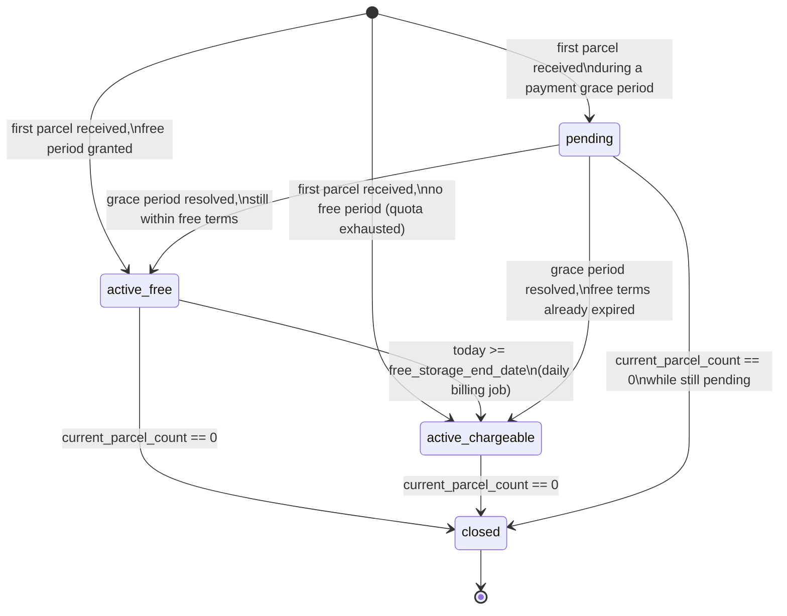

# Storage & Billing System

Implements spec [`09-storage-fee.md`](../../.claude/specs/09-storage-fee.md): a
per-Trunk-ID (`Locker`) shipment-batch model that replaces the old flat
per-parcel 30-day storage fee. Core logic lives in
[`services/batch_billing.py`](services/batch_billing.py) as pure functions —
every function takes `today` as an explicit `date` argument, so the whole
engine is testable without mocking the clock. Tests:
[`tests/test_batch_billing.py`](tests/test_batch_billing.py).

## State machine

- **`active_free`** — has parcels, free-storage period has not expired.
- **`active_chargeable`** — has parcels, free-storage period has expired. Daily charges apply.
- **`closed`** — `current_parcel_count` reached 0. Permanent; unused free days are lost, do not carry forward. A batch closes **only** when parcel count hits 0 — expiry of the free period alone never closes a batch.
- **`pending`** — a paid-plan renewal payment failed and the account is in its 7-day grace window (`Locker.payment_grace_until`); a batch opened during that window gets temporary 30-day Paid terms until the grace period resolves.

Additional parcels arriving while a batch is in any open state (`active_free`,
`active_chargeable`, or `pending`) join the **same** batch —
`current_parcel_count` increments, `free_storage_end_date` is never touched,
and the daily rate recalculates automatically from the new count. A new
batch is only created when a locker has **no open batch**
(`unique_open_batch_per_locker` enforces this at the database level; see
"Concurrency" below).

## Data model

- **`apps.locker.models.Batch`** — one row per shipment batch. `plan_type_at_creation`
  and `quota_year` are snapshotted at creation, independent of the locker's
  *current* plan (this is what makes downgrade batch-counting correct — see
  Fix #2 below).
- **`apps.locker.models.UserQuota`** — one row per **user** (not per locker —
  the annual Free-plan pass pool is shared across every Trunk ID a user has,
  per the spec's invariant, even though `Locker` is currently a strict
  `OneToOneField` to `User`).
- **`apps.payments.models.BatchCharge`** — one row per batch per billed day.
  `unique_batch_charge_per_day` makes the daily job idempotent; `on_delete=PROTECT`
  on `batch` keeps this a durable financial ledger even if a `Batch` row were
  ever deleted (application code never deletes one — batches only close).

## Rate table

Flat per-Trunk-ID daily charge, based on live `current_parcel_count` — never
multiplied by parcel count (see `lookup_daily_rate` in `batch_billing.py`):

| Parcels Stored | Daily Charge |
|---|---|
| 1–20 | ₹100/day |
| 21–30 | ₹150/day |
| 31–40 | ₹200/day |
| 41–50 | ₹250/day |
| 51–60 | ₹300/day |
| Every additional 10 | +₹50/day |

## Free-period rules by plan

- **Free**: 3 batch passes/calendar year, each granting 20 free days, drawn
  from `UserQuota`. Exhausted → new batches start `active_chargeable`
  immediately, no free days.
- **Paid**: unlimited batches, each granting 30 free days, no pass consumption.
- **`Locker.plan_type`** (`free`/`paid`) is a minimal flag added directly to
  `Locker` for this spec — it does not depend on the separate (currently
  unbuilt) tiered membership-plans system; if that ships later, `paid` is
  expected to map onto whichever tier a subscription resolves to, and this
  rate table stays the single source of truth for storage pricing.

## Quota: UserQuota is the sole source of truth

`UserQuota.passes_remaining`/`passes_used` are read/written under
`select_for_update()` by `create_batch`, `refund_pass_if_eligible`, and the
lazy annual reset — never recomputed from `Batch` history at read time. The
**one** exception is `compute_free_batches_remaining` (used only by
`apply_downgrade`), which scans `Batch` rows to fix a specific bug:

**Fix #2 — downgrade batch counting.** A downgrade must only count batches
created *while the user held Free-plan status*
(`Batch.plan_type_at_creation == 'free'`), never batches created during a
Paid period even if in the same calendar year. `compute_free_batches_remaining`
recomputes the correct value and *writes it back into* `UserQuota` — it's a
one-time reset at the moment of downgrade, not a parallel read path.

**Annual reset is lazy**, not a scheduled job — see `_ensure_current_year`,
called at the top of every quota-touching function. If `UserQuota.quota_year`
is stale, it resets to a fresh `annual_quota` pool immediately, on whichever
function touches it first after January 1st. This was a deliberate choice
over a cron-based reset: a cron job that doesn't run exactly on Jan 1 (holiday,
deploy freeze) would leave stale counters until it next fires; the lazy
reset can't miss.

## Grace period (Fix #1)

`enter_grace_period` starts a 7-day window (`Locker.payment_grace_until`).
Batches created during the window get `pending` status with temporary 30-day
Paid terms. `resolve_grace_period(locker, today, payment_succeeded)`:

- **Success**: clears the grace flag, `pending` batches become permanently
  `active_free`/`active_chargeable` under their existing Paid terms.
- **Failure**: executes the Paid→Free downgrade, then recalculates every
  still-`pending` batch under **Free-plan 20-day terms** (not the temporary
  30-day terms it was given) — consuming a pass if one is available,
  otherwise going straight to `active_chargeable`. If the recalculated free
  period has already passed, `_bill_retroactive` creates one `BatchCharge`
  per day for the gap.

## Abandonment clock (Fix #3)

`check_abandonment(batch, today)` is `True` once a batch has been overdue
≥60 days, anchored to `Batch.first_unpaid_charge_date` — **not**
`free_storage_end_date` — specifically to absorb billing/processing lag
between when the free period technically ends and when a charge is actually
attempted. The moment a batch closes (`current_parcel_count` hits 0),
`first_unpaid_charge_date` resets to `NULL` and the clock can never apply to
that batch again, regardless of any outstanding unpaid balance (which goes
through normal debt-collection instead — this function does not implement
locking/liquidation itself, only reports the state; that's a future
view/admin action).

## 24-hour refund

`refund_pass_if_eligible` refunds the pass a batch consumed if it closes on
the **same calendar day** it opened (the finest granularity available — `Batch`
stores dates, not timestamps). Guarded by `Batch.refund_issued` so a batch
can never be refunded twice; a second, independent batch closing same-day
later gets its own separate, legitimate refund.

## Concurrency

`unique_open_batch_per_locker` (a partial unique constraint on
`Batch.locker` where `batch_status` is open) is the actual enforcement of
"one open batch per Trunk ID." `create_batch` wraps the `UserQuota`
decrement and the `Batch` insert in one `@transaction.atomic()` block — if
two concurrent parcel-intake requests race and the second `INSERT` hits the
constraint, its quota decrement rolls back with it. The signal receiver in
[`signals.py`](signals.py) catches that `IntegrityError` and re-fetches the
batch that won the race, joining it via `add_parcel_to_batch` instead of
letting the exception 500 the request.

## Wiring: Parcel lifecycle → batches

[`signals.py`](signals.py) maps `Parcel.status` transitions onto the billing
engine — the *only* place this mapping is encoded. "Physically in warehouse"
is `{pending, action_required, approved}`; a parcel entering that set
creates/joins a batch, leaving it decrements (closing the batch at 0). A
brand-new `Parcel` (no prior "before" state) is treated as an explicit
"no batch → receiving" transition rather than inferred from a diff.

## Daily billing job

`python manage.py sync_storage_batches` — iterates every `active_free`/
`active_chargeable` batch and applies one day of `run_daily_billing` logic.
Safe to run twice on the same day: the `BatchCharge` insert happens inside
its own nested savepoint, so a `unique_batch_charge_per_day` violation is
caught and treated as "already billed today" without rolling back the
surrounding state transition.

**⚠️ This command is not currently wired to any scheduler.** Neither
`railway.toml`, `Procfile`, nor `render.yaml` in this repo define a
cron/scheduled-job mechanism — not even for the pre-existing `sync_tracking`
command, which has the same gap (its cron entry is only documented in a
docstring comment, never actually configured on either platform). If
`sync_storage_batches` is never invoked daily, batches never transition
`active_free → active_chargeable` and no charges are ever created — a
silent no-op that looks identical to "working, nobody's overdue yet." This
must be wired before the feature is relied on in production; flagged here as
a blocking follow-up with no owner assigned yet.

## Backfill

[`0008_backfill_batches_for_existing_parcels.py`](migrations/0008_backfill_batches_for_existing_parcels.py)
gives every locker that already had parcels in the warehouse before this
shipped one `active_chargeable` batch with no free period and no pass
consumed (these parcels predate the pass system; a retroactive free-period
grant would be arbitrary either way, so the conservative default — already
chargeable — was chosen over risking under-billing). `UserQuota` is
untouched by the backfill.

## Removed

The old per-parcel flat-30-day system (`StorageFee` model,
`_get_daily_storage_fee_amount`, `ensure_storage_fee_for_parcel`, the
`add_storage_fees` admin action, `_sync_overdue_storage_fees`, and
`Parcel.storage_days`/`days_remaining_free`/`is_storage_overdue`) is fully
removed — running both systems at once would double-charge users for the
same parcels. Everywhere that displayed per-parcel storage info now reads
from the locker's one open batch instead (`apps/locker/admin.py`'s
`storage_info`, the dashboard's `storage_days_left`/`avg_storage_days`,
`MyTrunkView`'s `days_left`, `ParcelDetailView`'s `storage_days_remaining`/
`storage_is_overdue`). Storage is no longer bundled into a shipment's
Razorpay payment order — `BatchCharge` belongs to a `Batch` (a Trunk ID),
not to any single shipment's parcels, so `CreatePaymentOrderView` now
collects shipping only; a `BatchCharge` gets its own `Payment(payment_type='storage_batch')`
via a future checkout flow (out of scope here, per the spec's "no new
routes").
